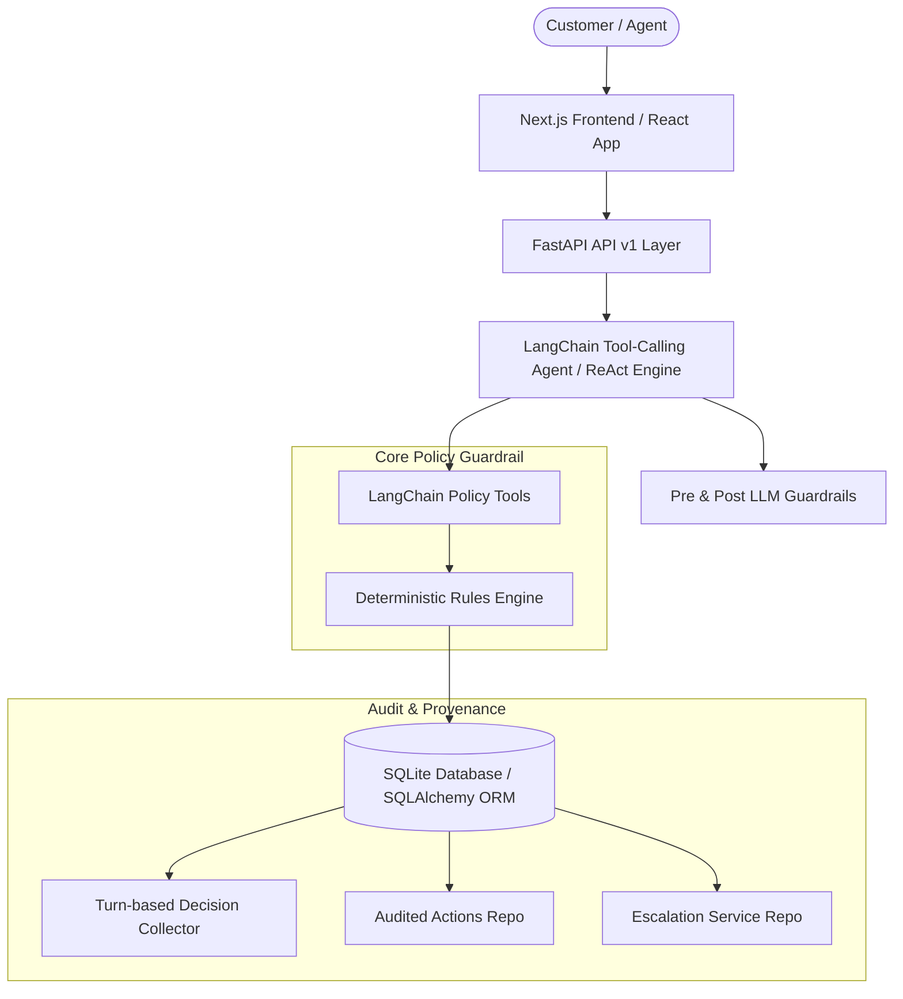

# Airline Disruption Resolution Agent ✈️

An empathetic, factual, choice-oriented **Airline Disruption Resolution Agent** system. Built with a **deterministic policy rules engine**, FastAPI backend, LangChain tool-calling agent with safety guardrails, and a modern Next.js frontend with live Policy Decision Trace, Audited Actions Log, and Escalation Alert panels.

---

## 🏛️ 1. Architecture & Process Flow

The core design principle is **Deterministic Policy Authority**: The AI LLM never decides airline policy independently. All disruption logic, entitlement calculations, meal vouchers, lounge access, hotel eligibility, and escalation decisions are governed strictly by a deterministic Python rules engine (`rules_engine.py`).

### System Architecture Diagram



### Process Flow
1. **Customer Selection & Authentication:** User selects a customer (Priya Nair, Arvind Kulkarni, or Meher Kaur) via the top header selector.
2. **Booking Context Ingestion:** Active booking records (PNR, segment, flight number, route, delay minutes, and status) are injected into the agent prompt.
3. **Disruption Inquiry:** Customer submits a disruption inquiry (e.g. flight cancellation, delay entitlement, upgrade, or refund request).
4. **Pre-LLM Safety Guardrail:** Message is checked for legal or formal complaint threats. If detected, LLM is bypassed and an instant escalation (`LEGAL_OR_FORMAL_COMPLAINT`) is created.
5. **Deterministic Policy Evaluation:** The agent executes appropriate policy tools (`evaluate_cancellation`, `evaluate_delay`, `request_refund`, `arrange_hotel`, `escalate_to_human`), which run `rules_engine.py` and log turn-based decision traces (`decision_trace`).
6. **Audited Action Execution:** Authorized resolution actions (`REFUND_REQUEST`, `MEAL_VOUCHER`, `LOUNGE_ACCESS`, `HOTEL_DELAYED_HOURS`) are written to the database with full JSON audit logs.
7. **Human Escalation Hand-off:** Requests exceeding policy (free business class upgrades, full-night hotel stays, or fare waivers > Rs 1,500) generate open support escalations for human specialist review.
8. **UI Live Rendering:** Frontend updates live with the **Policy Decision (From Rules Engine)** card, **Audited Actions Panel**, and **Support Escalation Alert**.

---

## 📊 2. Inputs, Sources, and Data Assumptions Used

### Data Sources & Seed Definition
The system is seeded with 3 realistic customer profiles and 4 flight booking segments (`backend/src/db/seed.py`):

| Customer Name | Tier | Flights (12m) | Booking PNR | Route | Flight No | Status & Cause |
| :--- | :--- | :--- | :--- | :--- | :--- | :--- |
| **Priya Nair** | Gold | 6 | `SK4821X` | Delhi $\rightarrow$ Goa | `SK-204` | **Cancelled** (Operational reasons) |
| **Arvind Kulkarni** | Silver | 3 | `TR1190B` | Mumbai $\rightarrow$ Bengaluru | `SK-118` | **Delayed 4h** (240 mins) |
| **Meher Kaur** | Platinum | 10 | `WL7742` | Delhi $\rightarrow$ Hyderabad | `SK-305` | **Delayed 6h** (360 mins) |

### PRD Policy Assumptions
* **Delay Thresholds:** 
  * $\le 180$ mins (3h): Rs 500 Meal Voucher.
  * $> 180$ mins & $\le 300$ mins (3h–5h): Rs 500 Meal Voucher + Lounge Access.
  * $> 300$ mins (>5h): Meal Voucher + Lounge Access + Hotel covering **delayed hours only** (not a full night).
* **Cancellation Policy:** Customer's choice of free rebooking on next available flight within 24 hours OR full refund to original payment method within 7 business days.
* **Loyalty Tiers:** Gold/Platinum tiers receive priority rebooking flags only; tier status **never** authorizes monetary policy exceptions or free business class upgrades.
* **Fare Difference Waivers:** Voluntary rebooking fare difference above Rs 1,500 requires supervisor approval (`FARE_WAIVER_ABOVE_1500`).

---

## 🤖 3. List of AI Tools Used and How They Were Used

1. **LangChain Tool-Calling ReAct Agent (`langgraph.prebuilt.create_react_agent`):**
   * Acts as the conversational agent wrapper around deterministic backend tools.
   * Executes multi-tool calling loops (ReAct pattern) to evaluate cancellations, delays, refunds, and escalations.
2. **LangChain Policy & Action Tools (`backend/src/agent/tools.py`):**
   * Encapsulates `get_booking_status`, `evaluate_delay`, `evaluate_cancellation`, `rebook`, `issue_voucher_lounge`, `arrange_hotel`, `request_refund`, `check_fare_difference`, and `escalate_to_human`.
   * Enforces `SessionLocal` database session fallbacks to write audit logs and decision traces safely.
3. **Multi-Provider LLM Integration (`langchain_google_genai`, `langchain_openai`, `langchain_groq`):**
   * Supports Google Gemini (`gemini-1.5-flash`), OpenAI (`gpt-4o-mini`), or Groq (`llama-3.3-70b-versatile`) configurable dynamically via `.env`.
4. **Deterministic Fallback Engine (`backend/src/agent/fallback.py`):**
   * Functions completely without an LLM API key. If `LLM_API_KEY` is missing or fails, the application switches to deterministic rule generation without degrading compliance.
5. **AI Pair Programming (Google Antigravity IDE & Gemini Assistant):**
   * Used for rapid component structuring, responsive CSS layout engineering, end-to-end test suite creation, and database query optimization.

---

## 🚀 4. Quick Start Guide

### Prerequisites
* Python 3.10+
* Node.js 18+

### 1. Backend Setup

```bash
# Navigate to backend directory
cd backend

# Install Python dependencies
pip install -r requirements.txt

# Create environment configuration file
cp .env.example .env

# Run FastAPI server
python -m uvicorn src.main:app --port 8000
```
* Backend URL: `http://localhost:8000`
* Interactive API Documentation (Swagger): `http://localhost:8000/docs`

### 2. Frontend Setup

```bash
# Open a new terminal and navigate to frontend directory
cd frontend

# Install Node dependencies
npm install

# Start Next.js development server
npm run dev
```
* Frontend Application URL: `http://localhost:3000`

---

## 🎯 5. Scenario Walkthrough (S1 – S3)

### S1 — Priya Nair (Gold Tier)
* **Flight Status:** `SK-204` cancelled (operational reasons).
* **Prompt to test:** `"My flight SK-204 was cancelled. I want a full refund and a free business class upgrade on my return flight."`
* **Result:** `REFUND_REQUEST` is logged in **Actions Log**. Requesting a free business class upgrade triggers **Escalation Alert** (`COMPENSATION_BEYOND_POLICY`).

### S2 — Arvind Kulkarni (Silver Tier)
* **Flight Status:** `SK-118` delayed 4 hours (240 mins).
* **Prompt to test:** `"My flight SK-118 is delayed by 4 hours. Can you arrange a hotel for me?"`
* **Result:** Policy evaluates `DELAY_3H_TO_5H`. **2 Executed Actions** (`MEAL_VOUCHER` + `LOUNGE_ACCESS`) logged in **Actions Log**. Hotel is denied because hotel eligibility requires delays >5 hours.

### S3 — Meher Kaur (Platinum Tier)
* **Flight Status:** `SK-305` delayed 6 hours (360 mins).
* **Prompt to test:** `"My flight SK-305 is delayed by 6 hours. I want a full night hotel and a higher-fare flight without paying the Rs 2,000 extra amount."`
* **Result:** `HOTEL_DELAYED_HOURS` logged in **Actions Log**. Requesting a full night hotel and Rs 2,000 fare waiver triggers **Escalation Alert** (`FARE_WAIVER_ABOVE_1500`).

---

## 🧪 6. E2E Verification & Test Suite

To run the automated scenario verification suite:

```bash
# Run standalone E2E scenarios verification
python scripts/e2e_scenarios.py

# Run full backend unit test suite (66 tests)
cd backend
python -m pytest tests
```

---

## 📤 7. Steps to Push to GitHub Securely

Follow these exact terminal steps to push your latest updates to GitHub safely without leaking `.env` secrets:

### Step 1: Check Git Status
```bash
git status
```

### Step 2: Stage files
```bash
git add backend/src/agent/agent.py backend/src/agent/prompts.py backend/src/agent/tools.py README.md .gitignore
```

### Step 3: Commit Changes
```bash
git commit -m "feat: complete airline disruption resolution agent with deterministic rules, dynamic audit logs, and escalations"
```

### Step 4: Push to Remote Repository
```bash
git push origin master
```
*(If pushing to main, replace `master` with `main`)*.
