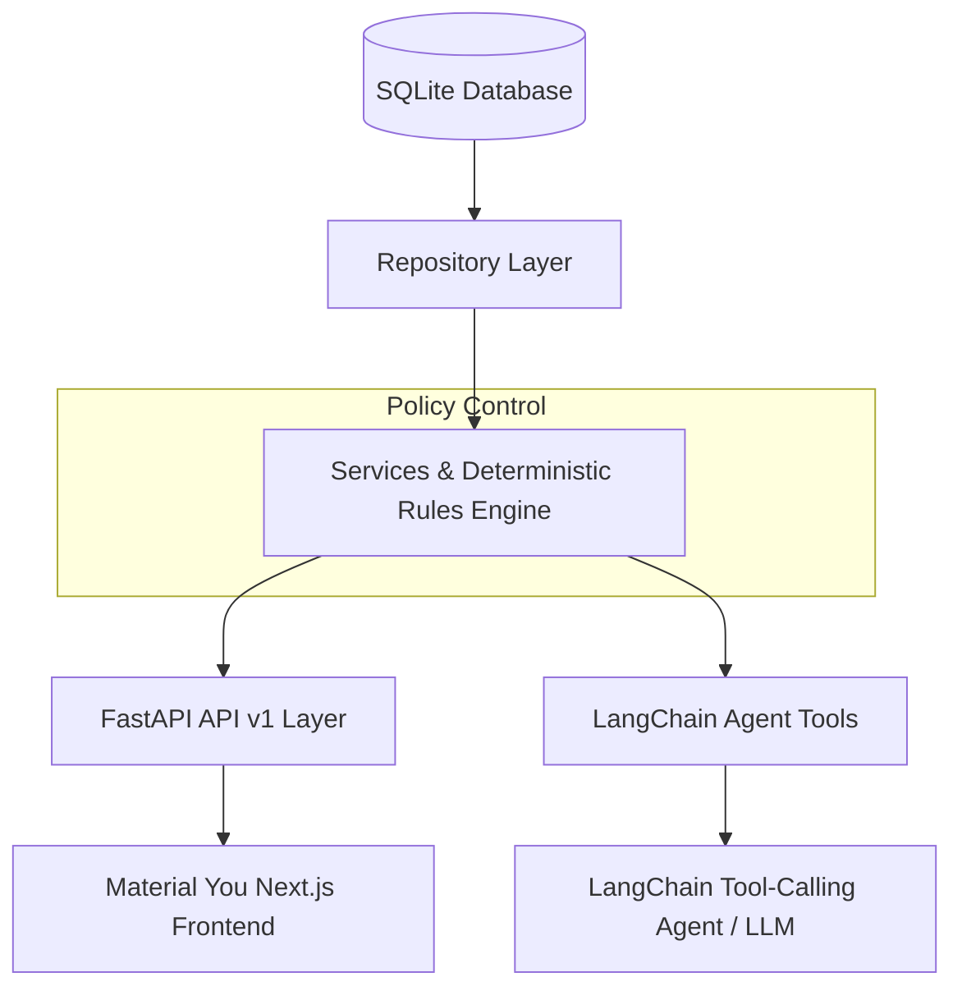

# Airline Disruption Resolution Agent (AIONOS Assignment 3)

An empathetic, choice-oriented, and factual customer-facing **Airline Disruption Resolution Agent** system. Built with a deterministic policy rules engine, FastAPI backend, LangChain tool-calling agent with safety guardrails, and a Material You Next.js frontend.

---

## Architecture & System Overview

The system enforces strict policy boundaries using a **deterministic rules engine**. The LLM never decides policy; it only phrases and formats decision outcomes. If an LLM key is absent or fails, a deterministic fallback engine handles resolution without degrading compliance.

### Mermaid Architecture



> **Core Policy Guarantee:** Rules engine decides policy. LLM only phrases the decision. Fallback is used when the LLM is unavailable or fails.

---

## Quick Start (Non-Docker)

### 1. Backend Setup

```bash
# Navigate to backend directory
cd backend

# Install Python dependencies
pip install -r requirements.txt

# Create environment file
cp .env.example .env

# Run FastAPI server
python -m uvicorn src.main:app --port 8000
```

The backend server runs at `http://localhost:8000`. API documentation (Swagger) is available at `http://localhost:8000/docs`.

### 2. Frontend Setup

```bash
# Navigate to frontend directory
cd frontend

# Install Node dependencies
npm install

# Start Next.js development server
npm run dev
```

The frontend application runs at `http://localhost:3000`.

---

## Environment & LLM Provider Configuration

### Deterministic Fallback Mode (No API Key Required)
The application functions **completely without an LLM API key** using a deterministic fallback engine. If `LLM_API_KEY` is empty or missing, all customer interactions automatically fall back to policy rules.

### Configurable LLM Providers

To use a live LLM, configure `backend/.env`:

#### OpenAI
```ini
LLM_PROVIDER=openai
LLM_API_KEY=your_openai_api_key
LLM_MODEL=gpt-4o-mini
```

#### Google Gemini
```ini
LLM_PROVIDER=gemini
LLM_API_KEY=your_gemini_api_key
LLM_MODEL=gemini-1.5-flash
```

#### Groq
```ini
LLM_PROVIDER=groq
LLM_API_KEY=your_groq_api_key
LLM_MODEL=openai/gpt-oss-20b
```

> *Note: Specify exact model identifiers documented by your provider's dashboard.*

---

## Folder Structure

```text
airline-resolution-agent/
├── backend/
│   ├── data/                   # SQLite database directory
│   ├── src/
│   │   ├── agent/              # LangChain agent, tools, guardrails, fallback
│   │   ├── api/                # FastAPI routers and endpoints
│   │   ├── core/               # Configuration, logging, exception handlers
│   │   ├── db/                 # Database connection and seed data
│   │   ├── models/             # SQLAlchemy ORM models
│   │   ├── repositories/       # Data access repositories
│   │   ├── schemas/            # Pydantic validation schemas
│   │   ├── services/           # Policy rules engine & business services
│   │   └── main.py             # FastAPI entrypoint
│   ├── tests/                  # Unit, scenario, and boundary test suite
│   ├── .env.example
│   └── requirements.txt
├── frontend/
│   ├── src/
│   │   ├── app/                # Next.js App Router pages and layout
│   │   ├── components/         # UI components (ChatWindow, DecisionTracePanel, etc.)
│   │   ├── hooks/              # Custom useChat hook
│   │   ├── lib/                # Constants and helper utilities
│   │   ├── services/           # Typed API service layer
│   │   └── types/              # TypeScript definitions
│   ├── .env.example
│   ├── .env.local
│   ├── package.json
│   ├── tailwind.config.ts
│   └── tsconfig.json
├── scripts/
│   └── e2e_scenarios.py         # Standalone E2E verification script
├── docker-compose.yml          # Optional Docker Compose orchestration
├── .gitignore
├── .gitattributes
└── README.md
```

---

## Scenario Walkthrough (S1 – S3)

### S1 — Priya Nair (Gold Tier)
* **Flight Status**: SK-204 cancelled (operational reasons).
* **Entitlements**: Free rebooking within 24h OR full refund to original payment method within 7 business days.
* **Special Request**: Free business-class upgrade on return segment is beyond policy and escalates as `COMPENSATION_BEYOND_POLICY`.
* **Guardrail**: Customer anger ("I am furious!") does NOT trigger legal threat escalation.

### S2 — Arvind Kulkarni (Silver Tier)
* **Flight Status**: SK-118 delayed 4 hours (240 mins).
* **Entitlements**: Rs 500 meal voucher + lounge access.
* **Special Request**: Hotel accommodation is DENIED because hotel eligibility requires delays > 5 hours (300 mins).

### S3 — Meher Kaur (Platinum Tier)
* **Flight Status**: SK-305 delayed 6 hours (360 mins).
* **Entitlements**: Meal voucher, lounge access, and hotel accommodation covering delayed hours ONLY (not full night).
* **Special Request 1**: Full-night hotel request escalates as `COMPENSATION_BEYOND_POLICY`.
* **Special Request 2**: Voluntary rebooking fare difference of Rs 2,000 is payable by customer. Waiver request escalates as `FARE_WAIVER_ABOVE_1500`.
* **Loyalty**: Platinum tier grants priority rebooking flag only.

---

## Known Data Gaps & PRD Documented Assumptions

* **Alternative Flight Inventory**: Specific replacement flight availability is not in the dataset (defaults to generic next available flight).
* **Meal Voucher Amount**: Specified as Rs 500 for delays under 3 hours; longer delays grant meal vouchers without explicit amount caps.
* **Lounge Access**: Explicitly stated for delays over 3 hours; implicitly included for longer delays.
* **Payment Method Details**: Customer account data does not contain stored card or bank details.
* **Return Flight Number**: Return booking segments do not have assigned flight numbers.
* **Boundary Conditions**: Exactly 180 min and 300 min delays are treated as the lower policy band.

---

## Core Design Decisions

1. **Deterministic Authority**: The policy rules engine in `services/rules_engine.py` is the single source of truth for all compensation and entitlement decisions.
2. **LLM Scoping**: The LLM is restricted to phrasing policy outputs empathetically and invoking tool definitions.
3. **Trace Provenance**: `decision_trace` objects are generated exclusively from deterministic `Decision` data structures, never parsed from LLM text.
4. **Fallback Guarantee**: If LLM API keys are unconfigured or fail, the system operates deterministically via fallback logic.

---

## E2E Scenario Verification

To run the standalone end-to-end scenario verification suite:

```bash
python scripts/e2e_scenarios.py
```

Expected output:
```text
=== Running AIONOS Assignment 3 E2E Scenario Verification ===
S1: PASS
S2: PASS
S3: PASS
=== ALL E2E SCENARIOS PASSED SUCCESSFULLY ===
```

---

## Optional Docker Deployment

To run both backend and frontend using Docker Compose:

```bash
docker-compose up --build
```

* **Frontend**: `http://localhost:3000`
* **Backend API**: `http://localhost:8000`
